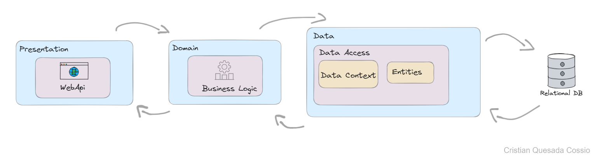

# Prueba Técnica

## Project Description

This project consists of a .NET Web API that provides a service for assigning 5-digit numbers per client and raffle.

## Main Functionality

- Assignment of 5-digit numbers for a raffle to users of different clients.

## Technologies Used

- ASP.NET Core Web API 8.0
- C#
- Entity Framework 8.4.0

## Project Structure

The project is organized into 3 layers as follows:

- **Presentation**: Contains the API controllers.
- **Domain**: Contains the business logic implemented by the API.
- **Data**: Contains objects (Entities) for data manipulation in memory and data access.
- **Data**: Contains data access logic, such as repositories or database context classes.

## Endpoint

### GetNumber

- **Description**: Returns a 5-digit number assigned to a client indicated as a parameter, also discriminated by the raffle.
- **HTTP Method**: GET
- **Route**: `/api/NumberAssignment` or `/api/NumberAssignment/GetNumber`
- **Parameters**:
  - clientId: Client identifier
  - userId: User identifier
  - raffleId: Raffle identifier
